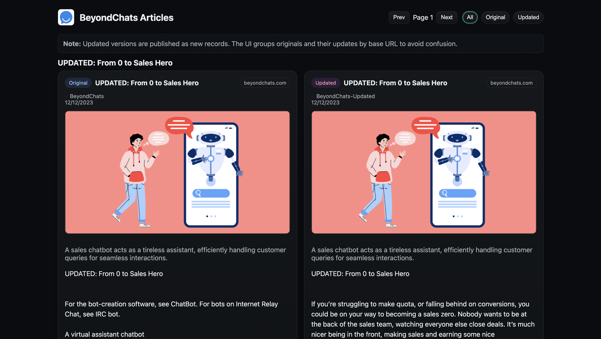

<div align="center">


### BeyondChats

Scrape the oldest BeyondChats blog posts, rewrite them intelligently using the best sources on the web, and present originals vs. updates in a clean UI with citations. This repo contains everything: Laravel, NodeJS (Groq/OpenAI), and React.



</div>

## Why This Exists
Publishing content that feels current, helpful, and well-structured matters. This project takes the five oldest BeyondChats blog posts and:
- Finds relevant articles ranked on Google/Bing to set a high-quality bar.
- Scrapes those references and uses an LLM (Groq preferred) to rewrite the originals for clarity and better web formatting.
- Publishes the updated versions with citations at the bottom.
- Displays originals and updates together in a simple, professional React UI.

## What’s Inside
- `beyondchats-api/` – Laravel app (Articles CRUD + scraper CLI)
- `content-updater/` – NodeJS script to search, scrape, rewrite, and publish
- `articles-frontend/` – React + Vite UI (grouping, filters, citations)

## Setup (Local)
Prereqs: PHP 8.2+, Composer, Node 18+, npm, SQLite (or MySQL), Git

1) Backend (Laravel)
- `cd beyondchats-api`
- `cp .env.example .env` and set `DB_CONNECTION=sqlite` (ensure `database/database.sqlite` exists)
- `composer install`
- `php artisan key:generate`
- `php artisan migrate`
- Scrape 5 oldest posts: `php artisan beyondchats:scrape --limit=5`
- Start API: `php artisan serve --host=127.0.0.1 --port=8001`

2) Updater (NodeJS + Groq/OpenAI)
- `cd content-updater && npm install`
- `.env`:
  - `API_BASE_URL=http://127.0.0.1:8001`
  - `GROQ_API_KEY=YOUR_KEY` (preferred) or `OPENAI_API_KEY=YOUR_KEY`
- Update five oldest: `API_BASE_URL=http://127.0.0.1:8001 npm start -- --mode=update-five`
- Clean duplicates: `API_BASE_URL=http://127.0.0.1:8001 npm start -- --mode=dedupe`
- Process one-by-one: `API_BASE_URL=http://127.0.0.1:8001 npm start -- --mode=one --skip=0..4`

3) Frontend (React)
- `cd articles-frontend && npm install`
- `VITE_API_BASE_URL=http://127.0.0.1:8001 npm run dev`
- Open `http://localhost:5173/`

## How It Works
1) The scraper grabs titles, metadata, and content from BeyondChats’ last blog page and stores them as `source=BeyondChats`.
2) The updater finds strong external references (Google/Bing first, SearXNG fallback), scrapes the main content from two articles, and asks an LLM to rewrite the original for clarity, structure, and tone. It appends a “References” block and publishes as `source=BeyondChats-Updated`.
3) The frontend groups by base URL so originals sit next to their updates, with clean badges and clickable citations.

## Architecture (Quick Sketch)
```
Scraper ──► Laravel API (CRUD + pagination) ◄── React UI
                 ▲         ▲
                 │         └─ publish updated articles
                 │
           Read originals
                 │
Node Updater (Groq/OpenAI) → Search → Scrape → Rewrite → Cite → Publish
```

## API Cheat Sheet
- `GET /api/articles?page=1&per_page=50` – List
- `POST /api/articles` – Create
- `PATCH /api/articles/{id}` – Update
- `DELETE /api/articles/{id}` – Delete

## Submission Notes
- Completeness: Scraper + API + updater + UI with citations
- ReadMe & setup docs: You’re reading them
- Live Link: Local dev link provided; deploy the frontend to Vercel/Netlify with `VITE_API_BASE_URL` pointing at your live Laravel API
- Code Quality: Clean structure, defensive scraping, and strict URL filtering

## GitHub
```
git init
echo "# BeyondChats" >> README.md
git add README.md
git commit -m "first commit"
git branch -M main
git remote add origin https://github.com/Aadiprofessional/BeyondChats.git
git push -u origin main
```
If push prompts for credentials, use a personal access token or `gh auth login`.

# BeyondChats
